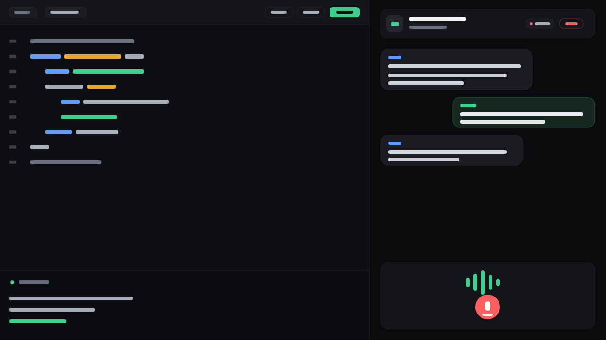

# 🎤 MockMate — AI Interview Simulator

> Practice technical interviews with an AI that **listens to your voice**, **reads your code**, and **scores your performance** in real time.

MockMate is a full-stack mock-interview platform. Pick an interviewer persona, talk through your reasoning out loud, write and run code in a real editor, and get a scored report at the end — all powered by an LLM over a realtime connection.

<p align="center">
  
</p>

<p align="center">
  
  
  
  
  
</p>

---

## ✨ Features

- **🎙️ Voice-driven interviews** — speak your answers; the browser transcribes them and the AI replies out loud (Web Speech API for both speech-to-text and text-to-speech).
- **🧠 Multiple interviewer personas** — Standard, Google (algorithms), Startup (velocity), System Design, Behavioral (HR), and a **Resume mode** that grills you on your uploaded PDF.
- **💻 Live coding** — a Monaco editor with a custom theme; run your code and see output in a collapsible console.
- **🧩 Practice mode** — a separate, self-paced page: generate a problem by topic/difficulty and solve it solo, no interview.
- **📊 Scored report + dashboard** — every interview ends with coding & communication scores plus actionable feedback, saved locally and visualised on a progress dashboard (stats + trend chart).
- **📄 Resume integration** — upload a PDF; the text is extracted and used to ask deep, personalised questions.
- **🎨 Polished, cohesive UI** — a custom dark design system (tokens for color, spacing, radius, typography), micro-animations, toasts, and full responsive layout.

## 🛠️ Tech stack

| Layer | Tech |
|---|---|
| **Frontend** | React 19, TypeScript, Vite, React Router, Monaco Editor, react-markdown |
| **Realtime** | SignalR (`@microsoft/signalr`) over WebSockets |
| **Voice** | Web Speech API — `SpeechRecognition` (STT) + `SpeechSynthesis` (TTS) |
| **Backend** | .NET 9, ASP.NET Core Web API, SignalR hub |
| **AI** | Groq API (`llama-3.1-8b-instant`) |
| **PDF** | UglyToad.PdfPig (resume text extraction) |
| **Storage** | Browser `localStorage` (interview history) |

## 🏗️ Architecture

```
        ┌──────────────────────────┐         REST  +  SignalR        ┌──────────────────────────┐
        │   React SPA (Vite)       │  ───────────────────────────▶   │   .NET 9 Web API         │
        │                          │                                 │                          │
        │  • Monaco editor         │   /api/problem/generate         │  • ProblemController     │
        │  • Web Speech (STT/TTS)  │   /api/code/run                 │  • CodeController        │
        │  • SignalR client        │   /api/resume/upload            │  • ResumeController      │
        │  • localStorage history  │   /interviewHub (WebSocket)     │  • InterviewHub          │
        └──────────────────────────┘                                 │  • GroqAiService ───────────▶ Groq API
                                                                      └──────────────────────────┘
```

The AI interviewer's conversation history is kept **per SignalR connection** (`ConversationStore`), so each interview is isolated and starts fresh.

## 🚀 Getting started

### Prerequisites
- [.NET 9 SDK](https://dotnet.microsoft.com/download)
- [Node.js 18+](https://nodejs.org/)
- A free **Groq API key** → [console.groq.com](https://console.groq.com)
- **Chrome or Edge** (the voice features use the Chromium Web Speech API)

### 1. Backend (`MockMate.API`)

```bash
cd MockMate.API

# Store your Groq key securely (never committed)
dotnet user-secrets set "GroqApiKey" "gsk_your_real_key_here"

dotnet run
```

The API starts on **http://localhost:5000**.

### 2. Frontend (`mockmate-ui`)

```bash
cd mockmate-ui
npm install
npm run dev
```

The app starts on **http://localhost:5173**. Open it in Chrome/Edge.

> The frontend talks to `http://localhost:5000` by default. To point it elsewhere (e.g. a deployed API), set `VITE_API_URL` — see `mockmate-ui/.env.example`.

## ⚙️ Configuration

| Setting | Where | Purpose |
|---|---|---|
| `GroqApiKey` | backend user-secrets / env | Auth for the Groq LLM API |
| `VITE_API_URL` | `mockmate-ui/.env` | Base URL of the API (defaults to localhost:5000) |

## 📡 API reference

| Method | Endpoint | Description |
|---|---|---|
| `POST` | `/api/code/run` | Runs the submitted code and returns its output |
| `GET`  | `/api/problem/generate?topic=&difficulty=` | Generates a coding problem (Markdown) |
| `POST` | `/api/resume/upload` | Extracts text from an uploaded PDF resume |
| `HUB`  | `/interviewHub` → `ProcessUserAudio`, `EndSession` | Realtime interview conversation + final scoring |

## 📁 Project structure

```
MockMate/
├── MockMate.API/            # .NET 9 backend
│   ├── Controllers/         # Code, Problem, Resume
│   ├── Hubs/                # InterviewHub (SignalR)
│   ├── Services/            # GroqAiService, CodeExecutionService, ConversationStore
│   └── Models/
└── mockmate-ui/             # React + Vite frontend
    └── src/
        ├── pages/           # Home, Interview, Practice, Dashboard
        ├── components/      # AudioVisualizer, Toast, Footer, ScoreChart
        └── lib/             # history (localStorage), editorTheme
```

## 🗺️ Roadmap

- Real sandboxed code execution (Judge0 / self-hosted Piston)
- Persistent, account-based history (Postgres + auth)
- Shareable / downloadable report cards

## 👤 Author

**Doğan Süle**
[GitHub](https://github.com/wingtion) · [LinkedIn](https://www.linkedin.com/in/do%C4%9Fan-s%C3%BCle/)

---

<sub>Built with .NET 9 & React.</sub>
